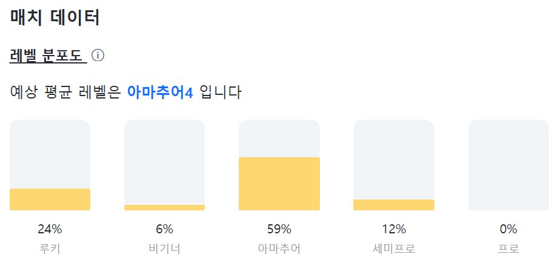

# ⚽플랩풋볼 매치 선정 자동화 프로젝트⚽

## 프로젝트 배경
저는 운동을 하고 싶을 때, 플랩이라는 풋살 경기 매칭 서비스를 자주 이용합니다. 플랩에서는 제가 거주하는 서울 중부/서남부 지역에서만 평일에는 약 60경기, 주말에는 약 80경기가 개최될 만큼 풋살 경기가 활발하게 열립니다. 저는 이번 학기 동안 플랩을 통해 총 7경기에 참가했습니다.

하지만, 원하는 시간대에 열리는 십수 개의 경기 중에서 가장 마음에 드는 매치를 찾으려면, 매번 각 경기의 상세 페이지를 하나씩 일일이 확인해야 했습니다. 이 과정이 번거롭고 시간도 많이 소요되어서, 보다 효율적으로 나에게 맞는 매치를 찾을 수 있는 방법이 필요하다고 느꼈습니다.

그래서 저는 이러한 과정을 자동화하고, 제 선호에 적합한 매치를 추천해 주는 프로젝트를 기획하게 되었습니다. 이 프로젝트를 통해 앞으로 매치 선정에 소요되는 시간을 줄이고, 더 쉽게 경기에 참가할 수 있기를 기대합니다.

## 매치 score 계산 기준
[예시 HTML 파일 보기](images/match_detail_page_example.html) (파일이 커서 미리보기가 안 되므로 다운로드해 주세요.)

[score_evaluate.py](score_evaluate.py) 파일을 실행하고 매치 상세 페이지에 해당하는 html 파일이 저장되어 있는 주소를 입력하면 다음과 같은 정보를 추출하여 각 기준별로 score를 부여하고 이를 합산하여 total_score를 산출합니다.  
1. 이미 해당 매치에 신청을 완료한 플레이어들의 실력 등급의 평균을 기준으로 score를 부여합니다.

예상 평균 레벨이 내 실력과 가장 비슷한 아마추어 3인 경우 10점을 부여하고 이와 멀어질수록 차등적으로 낮은 점수를 부여합니다.

(아마추어 2, 4 : 9점, 아마추어 1, 5 : 7점, 그 외 : 4점)   

2. 구장이 큰 매치에 높은 score를 부여합니다.

구장의 가로와 세로 정보를 추출하여 면적을 계산하고 이에 따라 score를 부여합니다.

(800 이상 : 5점, 750~799 : 4점 등)   

3. 해당 매치에 참가하는 POM 플레이어 1명당 score를 0.2점 부여합니다.
   

4. 여자 플레이어가 몇 명 신청하였는지에 대한 안내문을 출력합니다.

위와 같은 경우 다음 안내문을 출력합니다. "여자 플래버가 1명 참여하는 매치입니다!"   

5. 이 외에도 매치가 몇 대 몇으로 진행되는지에 따라 score를 부여하고, 책정된 참가비가 얼마인지에 따라 score를 부여합니다.

## 

