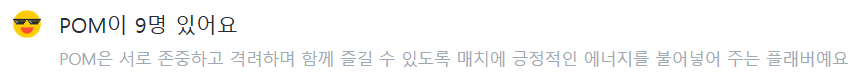
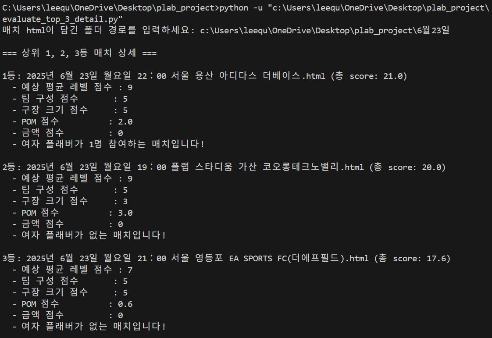

# ⚽플랩풋볼 매치 선정 자동화 프로젝트⚽

## 💡 프로젝트 배경 💡
저는 운동을 하고 싶을 때, 플랩이라는 풋살 경기 매칭 서비스를 자주 이용합니다. 플랩에서는 제가 거주하는 서울 중부/서남부 지역에서만 평일에는 약 60경기, 주말에는 약 80경기가 개최될 만큼 풋살 경기가 활발하게 열립니다. 저는 이번 학기 동안 플랩을 통해 총 7경기에 참가했습니다.

하지만, 원하는 시간대에 열리는 여러 경기들 중에서 가장 마음에 드는 매치를 찾으려면, 매번 각 경기의 상세 페이지를 하나씩 일일이 확인해야 했습니다. 이 과정이 번거롭고 시간도 많이 소요되어서, 보다 효율적으로 나에게 맞는 매치를 찾을 수 있는 방법이 필요하다고 느꼈습니다.

그래서 저는 이러한 과정을 자동화하여, 제 선호에 적합한 매치를 추천해 주는 프로젝트를 기획하게 되었습니다. 이 프로젝트를 통해 앞으로 매치 선정에 소요되는 시간을 줄이고, 더 쉽게 경기에 참가할 수 있기를 기대합니다.

## 🔧 설치 및 환경 🔧

- **Python 3**가 설치되어 있어야 합니다.  
  [Python 공식 다운로드 페이지](https://www.python.org/downloads/)에서 운영체제에 맞는 버전을 설치하세요.

- **필수 라이브러리:**  
  - `beautifulsoup4` (HTML 파일 파싱 및 정보 추출에 사용)

  #### 설치 방법
  
  터미널(명령 프롬프트)을 열고 아래 명령어를 입력하여 BeautifulSoup4를 설치합니다.
  
     ```bash
     pip install beautifulsoup4
  ```


## ➕ 매치 score 계산 기준 🟰
[예시 HTML 파일 보기](match_detail_page_example.html) (파일이 커서 미리보기가 안 되므로 다운로드해 주세요.)

[score_evaluate.py](score_evaluate.py) 파일을 실행하고 매치 상세 페이지에 해당하는 html 파일이 저장되어 있는 주소를 입력하면, BeautifulSoup 라이브러리를 활용하여 해당 html 파일에서 아래와 같은 정보를 추출합니다. 이후 각 정보에 대하여 사전에 정의한 기준에 따라 score를 부여하고, 이를 합산하여 total_score를 산출합니다.<br><br>


1. 이미 해당 매치에 

예상 평균 레벨이 내 실력과 가장 비슷한 아마추어 3인 경우 10점을 부여하고 이와 멀어질수록 차등적으로 낮은 점수를 부여합니다.
- 아마추어 2, 4 : 9점  
- 아마추어 1, 5 : 7점  
- 그 외 : 4점<br><br>

2. 구장이 큰 매치에 높은 score를 부여합니다.

구장의 가로와 세로 정보를 추출하여 면적을 계산하고 이에 따라 score를 부여합니다.

(800 이상 : 5점, 750~799 : 4점 등)<br><br>

3. 해당 매치에 참가하는 POM 플레이어 1명당 score를 0.2점 부여합니다.
<br><br>

4. 여자 플레이어가 몇 명 신청하였는지에 대한 안내문을 출력합니다.

위와 같은 경우 다음 안내문을 출력합니다. "여자 플래버가 1명 참여하는 매치입니다!"<br><br>

5. 이 외에도 매치의 팀 구성이 몇 대 몇인지에 따라 score를 부여하고, 책정된 참가비가 얼마인지에 따라 score를 부여합니다.<br><br>

## 📝 매치 선정 자동화 사용 방법 📝

원하는 지역과 시간을 만족하는 매치들의 상세 페이지 html을 하나의 폴더에 저장합니다. (ex. 서울 중부/서남부, 6월 23일 19시~22시에 시작하는 매치, 총 23개)<br>
이 과정에서 "SingleFile" 등 다중 html 다운로드를 지원하는 확장 프로그램을 이용하면 여러 매치의 상세 페이지를 보다 쉽게 저장할 수 있습니다.

[evaluate_top_3_detail.py](evaluate_top_3_detail.py) 파일을 실행하고 상세 페이지 html 파일들이 저장되어 있는 폴더의 주소를 입력하면, [score_evaluate.py](score_evaluate.py)를 import하여 각 매치에 대한 total_score를 계산합니다. 이후 다음과 같이 가장 높은 total_score를 얻은 top3 매치와 상세 내용을 출력합니다.



## 🚀 발전 가능성 및 향후 개선 방향 🚀

제가 아닌 다른 플랩 이용자들도, [score_evaluate.py](score_evaluate.py) 파일에서의 배점 기준을 각자의 선호도에 알맞게끔 조정하여 해당 프로젝트를 활용할 수 있습니다.

또한 사용자의 필요에 따른 다양한 기능을 추가하여 프로젝트를 개선할 여지도 충분합니다.<br>
예를 들어 저는 아직 차가 없지만, 차를 보유한 사용자의 경우 상세 페이지에서 무료 주차 여부를 추출하여, 무료 주차가 가능한 매치들만 선별해 top3를 추천하는 기능을 추가하여 사용할 수 있습니다.<br>
또한 상세 페이지에서 매니저 정보를 확인할 수 있기 때문에, 만약 이전에 불친절한 매니저를 경험한 적이 있다면 해당 매니저가 주관하는 경기는 제외하고 매치를 추천하도록 하는 기능도 추가하여 사용할 수 있습니다.

## 💭 소감 및 후기 💭

이번 프로젝트를 진행하면서 처음에는 GitHub라는 플랫폼에 대해서도 잘 몰랐지만, 직접 프로젝트를 기획하고 정리하여 GitHub에 공유하는 과정을 통해 프로그래밍 프로젝트가 어떻게 진행되는지 몸소 경험할 수 있었습니다.<br>
또한 프로젝트 주제로 제가 평소에 즐겨 사용하는 플랩 서비스를 선택하고, 실제로 앞으로 플랩 매치 선정에 활용하겠다는 목표를 가지고 임하다 보니 더욱 흥미를 느낄 수 있었고, 실질적으로 유용한 결과물을 만들기 위해 노력할 수 있었습니다.<br>
 (실제로 위 예시에서 top1으로 선정된 매치에 참가 신청하였습니다!)

그동안 프로그래밍의 활용법과 그 장점에 대해 이론적으로만 배워 왔는데, 이번 프로젝트를 통해 직접 프로그래밍을 활용하여 실제로 나의 시간과 노력을 절약해 줄 수 있는 결과물을 만들어 보니, 비로소 프로그래밍의 세계에 한 걸음 더 다가선 듯한 기분이 들었습니다.

## 🔗 참고 자료 🔗

- [플랩풋볼 공식 홈페이지](https://plapfootball.com/)
- [SingleFile GitHub](https://github.com/gildas-lormeau/SingleFile)
- [BeautifulSoup4 공식 문서](https://www.crummy.com/software/BeautifulSoup/bs4/doc/)


